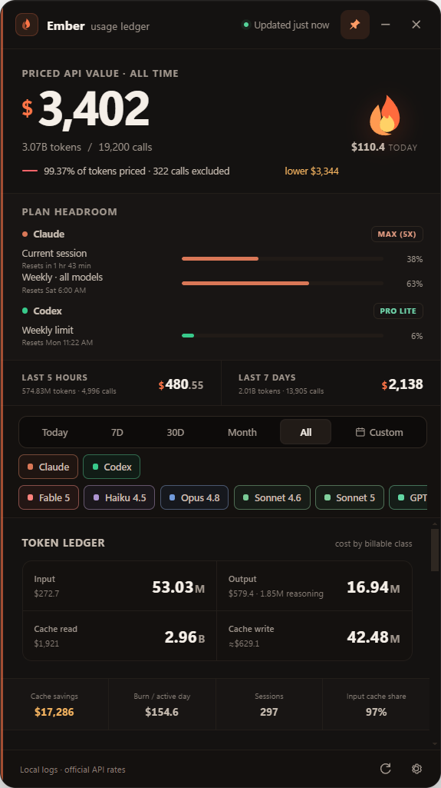

<div align="center">


# Ember

### Your AI coding burn, without the blind spots.

One private desktop ledger for **Claude Code + Codex + OpenCode** usage, plan headroom,<br />
and honest API-equivalent cost — updated live from the logs already on your machine.

[](https://github.com/HarshalVankudre/Ember-usage-widget/releases/latest)
[](https://github.com/HarshalVankudre/Ember-usage-widget/releases)
[](#install)
[](https://www.electronjs.org/)
[](LICENSE)

**[Download Ember](https://github.com/HarshalVankudre/Ember-usage-widget/releases/latest)** · [Explore features](#why-ember) · [How it works](#how-it-works) · [Build from source](#build-from-source)

<br />



<sub>The current Ember usage ledger — local data, live limits, official API rates.</sub>

</div>

---

## Why Ember

Subscriptions make AI coding feel unlimited right up until a session meter turns red. At the same time, millions of input, output, and cached tokens make it almost impossible to understand the value of what you used.

Ember turns those invisible meters into one calm, always-available desktop view.

| 🔥 Live headroom | ◉ Honest cost | ⏱ Complete history |
|---|---|---|
| Claude and Codex session and weekly limits—including Claude's separate Fable 5 quota—with reset countdowns. | Request-level pricing using each provider's official billing rules. | Durable local history, even after the original session logs are deleted. |

### Everything important, at a glance

- **One headline number** for combined Claude Code and Codex API-equivalent value
- **5-hour and 7-day windows**, including Claude's separate Fable 5 weekly quota
- **Provider and model filters** for instant isolation of any slice
- **Token ledger** for input, output, cache reads, cache writes, and measured reasoning
- **Interactive burn history** with daily drill-downs and custom date-and-time ranges
- **Model and project breakdowns** with screen-share privacy controls
- **Reactive plan meters** and a flame that visibly heats up near the limit
- **Tray residency, always-on-top, autostart, and Windows 11 acrylic**

> [!IMPORTANT]
> Ember shows the **API-equivalent value** of subscription usage. It is not your Claude or ChatGPT invoice.

## Built to show its work

Ember prices every request under its own provider before combining totals. Official pricing documents refresh daily and are cached for offline use. Missing public prices stay visibly **Unpriced** instead of being guessed.

| Billing detail | Claude | Codex |
|---|---|---|
| Input and output | Official per-model rates, including date-aware introductory pricing | Official per-model rates with historical long-context tiers |
| Cache reads | Discounted prompt-cache rate | Discounted cached-input rate |
| Cache writes | Logged 5-minute and 1-hour writes | Measured when present; otherwise a clearly labeled estimate range |
| Other modifiers | Fast mode, US inference geography, and logged web-search fees | GPT-5.4+ long-context multipliers |
| Unknown pricing | Dollar value omitted and marked **Unpriced** | Dollar value omitted and marked **Unpriced** |

<details>
<summary><strong>More about attribution and accuracy</strong></summary>

OpenAI model IDs used through Claude Code compatibility gateways or OpenCode's OpenAI provider are reattributed to Codex and repriced with OpenAI rules before aggregation. Codex reasoning is reported as a subset of output and is never counted twice. Non-Claude/OpenAI gateway models (such as Qwen) and internal `nexus-gpt-*` traffic are excluded from totals, charts, filters, projects, and model breakdowns.

When a Codex log omits cache-write counts, Ember presents the conservative estimate alongside the lower bound. The coverage line under the headline tells you exactly how much traffic was priced and how many calls remain unpriced. Unpriced calls and tokens stay in the usage totals; only their dollar value is omitted.

</details>

## Install

Ember supports **Windows 11**. Windows 11 22H2 or newer is recommended for the acrylic material.

1. Open the **[latest release](https://github.com/HarshalVankudre/Ember-usage-widget/releases/latest)**.
2. Choose the build that fits you:
   - `Ember Setup 1.3.0.exe` — one-click per-user install, shortcuts, tray, and autostart
   - `Ember Portable 1.3.0.exe` — one self-contained executable, no installation
3. Launch Ember. Existing local Claude Code and Codex sessions appear automatically.

No API keys. No account setup. No database to configure.

## How it works

```text
Claude Code logs ─┐
                  ├─► normalize ─► price per request ─► local history ─► Ember
Codex rollouts ───┘
```

| Source | Claude | Codex |
|---|---|---|
| Usage | `~/.claude/projects/**/*.jsonl` | `~/.codex/sessions`, `archived_sessions`, and OpenAI requests in `~/.local/share/opencode/opencode.db` |
| Plan limits | Read-only Anthropic account API using Claude Code's existing OAuth token | Local `rate_limits` snapshots from rollout logs |
| Updates | Debounced filesystem watcher plus periodic reconciliation | Debounced filesystem watcher plus periodic reconciliation |

Parsed records live in Ember's own local cache, so cleaning up old session logs does not erase your history. Deleted projects move into a collapsed group, and projects can be blurred and excluded from totals before a screen share.

> [!NOTE]
> Ember reads your usage sources in place. Usage history, settings, and pricing caches remain on your machine; Ember adds no telemetry or cloud account.

## Build from source

Requires [Node.js](https://nodejs.org/) and npm.

```bash
git clone https://github.com/HarshalVankudre/Ember-usage-widget.git
cd Ember-usage-widget
npm install
npm start
```

Useful commands:

```bash
npm test       # pricing, limits, attribution, and aggregation checks
npm run icon   # regenerate application and tray icons
npm run dist   # build the installer and portable executable
```

For a reproducible UI capture, set `WIDGET_SHOT` before starting Ember. The app waits for the first complete render and writes screenshots automatically.

## Author

Created and maintained by **[Harshal Vankudre](https://github.com/HarshalVankudre)**.

The Ember flame uses Microsoft's [Fluent Emoji](https://github.com/microsoft/fluentui-emoji) fire artwork under the MIT license. Ember grew from the original Claude and Codex usage widgets into a single, provider-aware ledger.

## License

[MIT](LICENSE) © Harshal Vankudre
